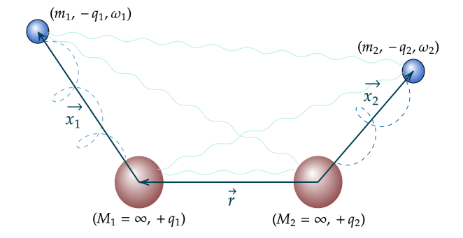

# Quartic Potential

## Requirements

* python 3
* numpy

## Installation

Clone this repository on your machine and cd to the corresponding directory. Then simply run:
```shell
pip install -e .
```

## QDOs



## Usage

```shell
python src/main.py \
    --atom1 H \
    --atom2 H \
    --r 1.0 2.0 2.5 \
    --tau 1.0 2.0 \
    --energy_unit hartree
```

- The list of available atomic elements is the following: ['H', 'Li', 'K', 'Rb', 'Cs', 'He', 'Ne', 'Ar', 'Kr', 'Xe']
- The user should provide a list of distances between the two QDO centers and of strength of the external electric field. The lists can of course contain a single element, and one can turn of the external electric field by setting it equal to 0.
- The list of available energy units is the following: ['hartree', 'eV', 'cm-1', 'kcalPerMol', 'kJPerMol', 'kelvin', 'J', 'Hz']. The default one is 'hartree'.
- The results are saved in json format in the 'results' directory.

## Citation


## License
[Apache License 2.0](https://github.com/MatthieuSarkis/Quartic-Potential/blob/master/LICENSE)